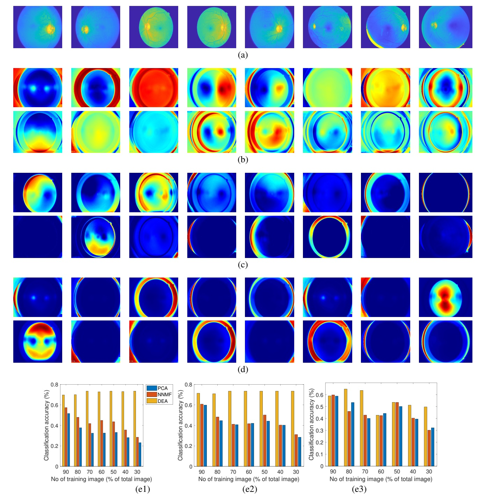

# distinctive-element-analysis

This code is implementation of algorithm presented in "Discovering distinctive elements of biomedical datasets for neuro-inspired exploration, under review, 2021".

# Motivation

The human brain represents an object by small elements and distinguishes two objects based on the difference in elements. Discovering the distinctive elements of high-dimensional datasets is therefore critical in numerous perception-driven biomedical studies. However, currently there is no available method for reliable extraction of distinctive elements of high-dimensional biomedical datasets. Here we present an unsupervised deep learning technique namely distinctive element analysis (DEA), which extracts the distinctive data elements using high-dimensional correlative information of the datasets. DEA computes a large number of distinctive elements, then filters and condenses the elements by employing a unique  triple-optimization network.   DEA has been found to improve the accuracy by 10-40\% in comparison to the traditional techniques in applications such as disease detection from medical images, gene ranking and cell recognition from scRNA-seq datasets. Moreover, DEA allows user-guided manipulation of the intermediate calculation process and thus offers intermediate results with better interpretability.

# Results for Diabetic retinopathy dataset:

Figure 1. (a) 8 randomly selected images of diabetic retinopathy data (b-left to right) First 16 eigen faces (principle
components). (c-left to right) 16 component Faces from NNMF. (d-left to right) 16 component Faces from DEA. The number
of reduced components by all the methods was 32. Holistic representation is achieved in case of eigen faces. Part based
representation is seen in NNMF faces. In case of DEA, we see that only distinctive features of the faces at different parts are
seen. The level of distinction is can also be realized from DEA faces. NNMF faces also have different levels of intensity.
However, these intensity differences do not represent any distinction levels, rather they are representatives of the image
intensity at different parts and linear combination of them produces the original image. Classification accuracy by PCA,
NNMF, and DEA for component numbers of 8, 16, and 32 (e1-e3). The accuracy for CapsNet, GoogleNet and DenseNet for
70% training data is 67%, 73% and 79%, respectively.

